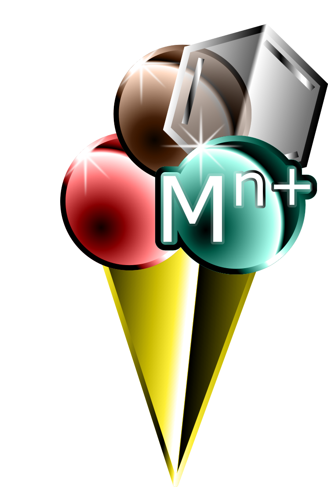

<p align="center">

</p>

# Metallicious 

Metallicious (a playful combination of "metal" and "delicious") is an automated tool for creating force fields for metal-containing systems with a covalent model of the metal. By utilizing a library of templates, Metallicious identifies the template that matches the metal site in the structure. It copies the bonded parameters from the template and performs charge redistribution to account for charge transfer. In cases where no suitable template is found, Metallicious automatically performs parameterization.


Metallicious works with minimal user input, relying heavily on educated guesses, which may not always yield the expected results. Therefore, it is recommended to use the tool with caution.

## Requirements:
- [rdkit](https://www.rdkit.org/)
- [networkx](https://networkx.org/)
- [MDAnalysis](https://www.mdanalysis.org/)
- [ParmEd](https://parmed.github.io/ParmEd/html/index.html)

(**Optional**) the parametrization of templates requires:
- [autode](https://github.com/duartegroup/autodE)
- [ORCA](https://orcaforum.kofo.mpg.de/app.php/portal)
- [psiRESP](https://github.com/lilyminium/psiresp)

(**Optional**) simple force-field parametrization with General Amber Force-field (GAFF) requires:
- [ambertools](https://ambermd.org/AmberTools.php)

**Limitations**: The code currently supports organometallic structures with metals separated by at least 2 non-metal atoms. Metal clusters are not supported. Additionally, metals of the same type must have the same charge and multiplicity.

## Installation:
```
conda install autode psiresp mdanalysis networkx qcelemental==0.25.1 ambertools --channel conda-forge
pip install metallicious
```
## Quick start
Parametrization of structure wih coordinates saved in `ru_pd.xyz` with (nonbonded) topology `ru_pd.top` (of the whole structure): 

```
from metallicious import supramolecular_structure
cage = supramolecular_structure('ru_pd.xyz', metal_charges={'Ru': 2, 'Pd':2 }, topol='ru_pd.top', vdw_type='uff')
cage.parametrize(out_coord='out.pdb', out_topol='out.top')
```
The `supramolecular_structure` function takes a coordination file (*.xyz, *.pdb, *.gro, etc. supported by MDAnalysis), topolog file (*top, *prmtop, supported by ParmEd), dictionary of metal ions along with their charge (and in case template parametrization is needed multiplicity) and type of Van der Waals metal paramters as input.

## Initial topology file
If you don't have a topology file, you can generate a simple force-field parametrization using General Amber Force-field (GAFF):

```
from metallicious import supramolecular_structure
cage = supramolecular_structure('ru_pd.xyz', metal_charges={'Ru': 2, 'Pd':2 }, vdw_type='uff')
cage.prepare_initial_topology()
cage.parametrize(out_coord='out.pdb', out_topol='out.top')
```
However, we do not intend to automate parametrization of the organic part of the molecule.
Please refer to specialised tools such as gromacs, atb, ambertools and charmm-gui. 


# Handling missing templates

The number of combination of possible ligands and metal results that inevitibly you will encounter metal site for which there is no template. 
In such cases to solutions are possible:

### 1. Parametrize template 
We recommend to run template parametrization on HPC/cluster as it can take some time (our experience is ~8h on 8 CPUs per template).

Specifing explicitly the metal multiplicity using the metal_charge_mult variable instead of metal_charges, will automaticly infrom metallicious to be ready to parametrize the template

```
from metallicious import supramolecular_structure
cage = supramolecular_structure('ru_pd.xyz', metal_charge_mult = {'Ru': (2,1), 'Pd':(2,1)}, vdw_type='uff')
cage.parametrize(out_coord='out.pdb', out_topol='out.top')
```

### 2. Truncate existing template

If an exact template is unavailable in the library, you can truncate part of an existing template.
Truncation is based on the distance from the metal centre, such as 4-bonds away ("dihedral"), 3-bonds away ("angles"), or 1-bond away ("bonds").
Such a strategy is fast but results in a loss of accuracy.

For example:
```
from metallicious import supramolecular_structure
cage = supramolecular_structure('ru_pd.xyz', metal_charge_mult = {'Ru': (2,1), 'Pd':(2,1)}, truncation_scheme = 'dihedral')
cage.parametrize(out_coord='out.pdb', out_topol='out.top')
```

## Command line
It is also possible to use the metallicious just form command line. For example:
```
metallicious -f cage.xyz -vdw_type merz-tip3p -metal_and_charges Pd 2 -prepare_topol
```
For details see:
```
metallicious -h
```