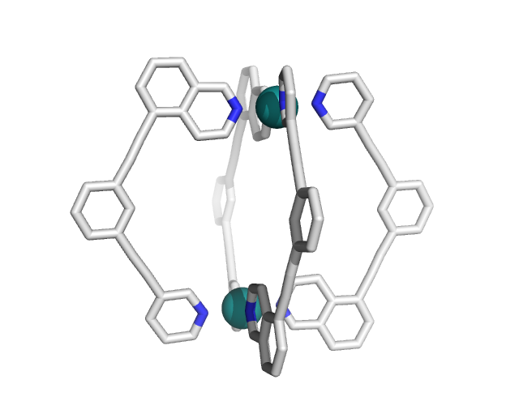
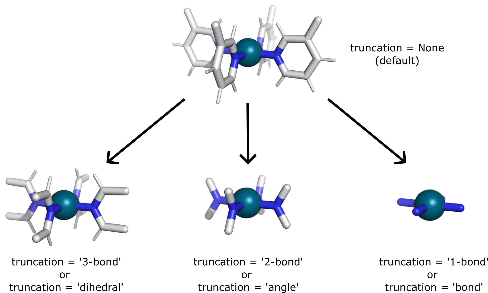

Examples
=====

.. _examples:

This is extended desription of the examples provided in metallicious package (see `examples <https://github.com/tkpiskorz/metallicious/tree/main/metallicious/examples>`_)

Example 1: Quick start
------------

(see `example_1/ <https://github.com/duartegroup/metallicious/tree/main/metallicious/examples/example1_quick_start>`_) Simple parametrization of the cage with two metals. As input, we provide a coordination file in PDB format and non-bonded
force-field parameters in *.top format (GROMACS). Moreover, LJ parameters of the Ru and Pd are taken from the universal force-field
(vdw_type='uff'), as Ru is available only in this library.

.. code-block:: python

    from metallicious import supramolecular_structure
    cage = supramolecular_structure('ru_pd.pdb', metal_charges={'Ru': 2, 'Pd':2 },
                                    topol='ru_pd.top', LJ_type='uff')
    cage.parametrize(out_coord='out.pdb', out_topol='out.top')

Example 2a: Automated initial force-field parameters
------------

(see `example_2/ <https://github.com/duartegroup/metallicious/tree/main/metallicious/examples/example2_no_topology>`_) If the force-field parameters are missing, the linker(s) can be parametrized using AmberTools with a GAFF force field.
*metallicious* will prepare the non-bonded force-field parameters of the whole structure, which are saved to the folder "init_topol."

.. code-block:: python

    from metallicious import supramolecular_structure
    cage = supramolecular_structure('ru_pd.xyz', metal_charges={'Ru': 2, 'Pd':2 }, LJ_type='uff')
    cage.parametrize(out_coord='out.pdb', out_topol='out.top', prepare_initial_topology=True)

Example 2b: Different formats
------------

The parameters can be saved to different formats supported by MDAnalysis and parmED.
For example, they can be saved into AMBER format force-field:

.. code-block:: python

    from metallicious import supramolecular_structure
    cage = supramolecular_structure('ru_pd.xyz', metal_charges={'Ru': 2, 'Pd':2 }, LJ_type='uff')
    cage.prepare_initial_topology()
    cage.parametrize(out_coord='out.inpcrd', out_topol='out.prmtop')

Alternatively, you prepare_initial_topology can be specified in .parametrize:

.. code-block:: python

    from metallicious import supramolecular_structure
    cage = supramolecular_structure('ru_pd.xyz', metal_charges={'Ru': 2, 'Pd':2 }, LJ_type='uff')
    cage.parametrize(out_coord='out.inpcrd', out_topol='out.prmtop', prepare_initial_topology=True)

Example 3: Homoleptic cage
------------

(see `example_3/ <https://github.com/duartegroup/metallicious/tree/main/metallicious/examples/example3_only_linker_topology>`_)
In the case of homoleptic cages (all linkers are the same), *metallicious* can use force-field parameters of single linker,
which will be used to generate the initial topology of the whole structure:

.. code-block:: python

    from metallicious import supramolecular_structure
    cage = supramolecular_structure('ru_pd.xyz', metal_charges={'Ru': 2, 'Pd':2 }, LJ_type='uff')
    cage.prepare_initial_topology(homoleptic_ligand_topol='linker.top')
    cage.parametrize(out_coord='out.pdb', out_topol='out.top')

Missing templates
------------

Inevitably, one will encounter structures for which the library has no suitable template. For example, there is no template available for the structure shown below:

Running python script:

.. code-block:: python

    from metallicious import supramolecular_structure
    cage = supramolecular_structure('cage.pdb', topol='topol.top', metal_charges={'Pd':2 },
                                    LJ_type='merz-opc')
    cage.parametrize(out_coord='out.pdb', out_topol='out.top', prepare_initial_topology=True)

will raise an error:

.. code-block:: python

    "Template not found (try to (a) parametrize it (specify multiplicity) or (b) truncate template)"".

Two solutions are available:
1. Create a new template, which is automated but time-consuming
2. use truncation schemes, which are fast but with reduced accuracy (caution is also needed)

Example 4: Parametrization of new template
------------

(see `example_4/ <https://github.com/duartegroup/metallicious/tree/main/metallicious/examples/example4_template_parametrization>`_) If template parameters are unavailable, one may want to parametrize them. In *metallicious*, this is done by
specifying the multiplicity of the metal, which signals *metallicious* to perform QM calculations if necessary. For this functionality, the additional
dependencies (see installation guide) are needed (`autode <https://github.com/duartegroup/autodE>`_, `ORCA <https://orcaforum.kofo.mpg.de/app.php/portal>`_, and `psiRESP <https://github.com/lilyminium/psiresp>`_).

.. code-block:: python

    from metallicious import supramolecular_structure
    cage = supramolecular_structure('cage.pdb', topol='topol.top', metal_charges_mult={'Pd': (2,1)},
                                    LJ_type='merz-opc')
    cage.parametrize(out_coord='out.pdb', out_topol='out.top', prepare_initial_topology=True)

Bear in mind that the parametrization of the template is time-consuming due to the computational cost of QM calculations.
By default, autodE uses 4 CPUs, which can be modified:

.. code-block:: python

    from metallicious import supramolecular_structure
    import autode as ade
    ade.Config.n_cores = 8
    cage = supramolecular_structure('cage.pdb', topol='topol.top', metal_charges={'Pd':2 },
                                    LJ_type='merz-opc')
    cage.parametrize(out_coord='out.pdb', out_topol='out.top', prepare_initial_topology=True)

By default, QM calculations are done using D3BJ-PBE0/def2-SVP (keywords = ['PBE0', 'D3BJ', 'def2-SVP', 'tightOPT', 'freq']),
which can be changed by specifying "keywords" in the supramolecular_structure class:

.. code-block:: python

    from metallicious import supramolecular_structure
    cage = supramolecular_structure('cage.pdb', topol='topol.top', metal_charges={'Pd':2 },
    LJ_type='merz-opc', keywords= ['D3BJ', 'B3LYP', '6-31G*', 'tightOPT', 'freq'])
    cage.parametrize(out_coord='out.pdb', out_topol='out.top', prepare_initial_topology=True)

Example 5: Truncation schemes
------------

(see `example_5/ https://github.com/duartegroup/metallicious/tree/main/metallicious/examples/example5_truncation_scheme`_)
Truncation schemes allow the "recycling" of existing templates from the library by reducing their size, which might match the metal site of interest.
Three schemes are available, cutting the template at a distance of 3-bond, 2-bond, and 1-bond from the metal centre.
For example, one of the existing templates in the library can be truncated as follows:

|

Result in templates which might match the metal site. They can be used by specifying truncation_scheme in the supramolecular_structure class:

.. code-block:: python

    from metallicious import supramolecular_structure
    cage = supramolecular_structure('cage.pdb', topol='topol.top', metal_charges={'Pd':2 },
                                     LJ_type='merz-opc', truncation_scheme='dihedral')
    cage.parametrize(out_coord='out.pdb', out_topol='out.top')

However, they come with reduced accuracy and need to be used cautiously.