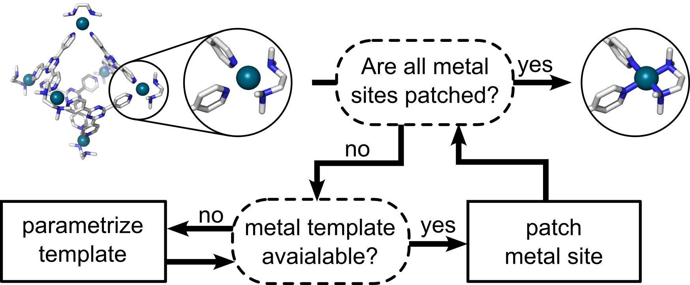

Welcome to metallicious's documentation!
===================================

**metallicious** is an automated tool for creating force fields for metal-containing systems with a covalent model of the metal. By utilizing a library of templates, Metallicious identifies the template that matches the metal site in the structure. It copies the bonded parameters from the template and performs charge redistribution to account for charge transfer. In cases where no suitable template is found, Metallicious automatically performs parameterization.

**Limitations**: The code currently supports organometallic structures with metals separated by at least 2 non-metal atoms. Metal clusters are not supported. Additionally, metals of the same type must have the same charge and multiplicity.

.. note::

   This project is under active development.

Contents
--------

.. toctree::

   installation
   usage
   examples
   tutorials
