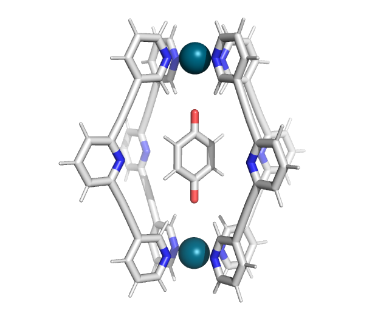

Tutorials
=====

.. _tutorials:

Tutorial 1: Force-field parameters from SMILES string
------------

It is straightforward to obtain force-field parameters just from SMILES string by combining the functionality of metallicious with `cgbind <https://github.com/duartegroup/cgbind/tree/master>`_:

.. code-block:: python

    from cgbind import Linker, Cage
    from metallicious import supramolecular_structure

    # Create coordination file from cgbind
    linker = Linker(smiles='C1(C#CC2=CC=CC(C#CC3=CC=CN=C3)=C2)=CC=CN=C1', arch_name='m2l4')
    cage = Cage(linker, metal='Pd')
    cage.print_xyz_file(filename="cage.xyz")

    # Parametrize the cage, use AmberTools to parametrize organic linkers
    cage = supramolecular_structure('cage.xyz', metal_charges={'Pd': 2}, LJ_type='uff')
    cage.parametrize(out_coord='out.pdb', out_topol='out.top', prepare_initial_topology=True)

Tutorial 2: Parametrization of template for gallium cages (known issue and solution)
------------

Metallicious uses educated guesses along the way. While we observe that this works in most cases, we also found one outlier: parametrization of the template for [Ga4L6]12- cages.
To parametrize the template, *metalliciuos* uses the charge of the metal (user input) and guessed charge of the attached ligand fragment.
The charge of the organic ligand is guessed by rdkit from the 3D structure of the atoms. While this works for most of the molecules,
sometimes there might be ambiguity about the structure. In this example, the coordinating ligand can have two chemical structures:

.. image:: images/gallium.png
  :width: 200
  :align: center
  :alt:

*metallicious* incorrectly guesses the neutral charge of the ligand. However, this behaviour can be corrected by overwriting guessed charges:

.. code-block:: python

    from metallicious import supramolecular_structure
    cage = supramolecular_structure('nonbonded.pdb', {'Ga': (3, 1)},
                                    topol = 'noncovalent_complex.top',
                                    LJ_type='uff', search_library=False)
    cage.extract_unique_metal_sites()
    cage.unique_sites[0].ligand_charges = [-2, -2, -2] #this specifies ligands' charges
    cage.parametrize()

While it is worth noting this, this template is part of the default library, so it is already parametrized.

Tutorial 3: Using custom template
------------

One might decide that they parametrized the template using a specific methodology (explicit solvent, or diffrent than usuall level of theory)
and did not save it to the library.
One might use this template on purpose for specific application

.. code-block:: python

    cage = supramolecular_structure(f'cage.xyz',
                                    metal_charges={'Pd': 2},
                                    LJ_type = 'uff',
                                    search_library=False)
    cage.extract_unique_metal_sites() # extracts template structures (needed to detect sites)
    cage.sites[0].fp_coord_file = f'selected_template.pdb' # loads coordinates of the template
    cage.sites[0].fp_topol_file = f'selected_template.top' # loads force-field parameters of the template
    cage.sites[0].load_fingerprint() # loads template into the class
    cage.sites[0].set_cutoff() # reads the radius of the template
    cage.unique_sites = [] # overwrites list with templates to parameterize (no template parametrization needed)
    cage.parametrize(out_coord='saturated_template.pdb', out_topol='saturated_template.top')

Tutorial 4: Custom template library
------------

As default *metallicious* has a library of the templates parametrized using D3BJ-PBE0/def2-SVP and they are saved in directory of *metallicious* in library folder.
One might however opt for higher level of theory or include implicit solvent effect. The easiest is to create new directory for library of templates.
This requires only change of the library_directory, as there are no templates inside, we need to parametrize them using new method:

.. code-block:: python

    from metallicious import supramolecular_structure
    cage = supramolecular_structure('nonbonded.pdb', {'Pd': (2, 1)},
                                    topol = 'noncovalent_complex.top',
                                    LJ_type='uff'
                                    library_path=f'/path/to/new/library/',
                                    keywords = ['CPCM(Water)', 'PBE0', 'D3BJ', 'def2-SVP', 'tightOPT', 'freq'])
    cage.parametrize()

Tutorial 5: GROMACS tutorial for MD simulations of metallorganic structures from scratch
-----------

This tutorial will guide you in performing an MD simulation from scratch using `GROMACS <https://www.gromacs.org/>`_. We will simulate a Fujita's Pd4L6 cage in water.
The files needed for this tutorial are available `here <https://github.com/duartegroup/metallicious/tree/main/metallicious/examples/tutorial5/tutorial.zip>`_.

Firstly, create the topology (force-field parameters) files from .xyz file using *metallicious*:

.. code-block:: python

    from metallicious import supramolecular_structure
    cage = supramolecular_structure('cage_start.pdb', metal_charges={'Pd': 2}, LJ_type='uff')
    cage.parametrize(out_coord='0_cage.pdb', out_topol='topol.top', prepare_initial_topology=True)

Execute the script:

.. code-block:: bash

    python script.py

With the topology ready, we will set up the system. Modify the size of the simulation box to accommodate
the cage (we use 2 nm distance from the cage to the wall):

.. code-block:: bash

    gmx editconf -f 0_cage.pdb -d 2 -o 1_box.pdb

Solvate the system with water (here, we use a 3-site water model):

.. code-block:: bash

    gmx solvate -cp 1_box.pdb -cs spc216.gro -o 2_solv.gro -p topol.top

Change the topology files. Open the "topol.top" file and change the header:

.. code-block:: bash

    [ defaults ]
    ; nbfunc        comb-rule       gen-pairs       fudgeLJ fudgeQQ
    1               2               yes             0.5          0.833333

to force-field parameters, which include atom types of water:

.. code-block:: bash

    #include "amber99sb-ildn.ff/forcefield.itp"

This will include all LJ parameters for atoms (including solvent and ions). Next, add information about the force-field
parameters for water and ions just under the section "[ atomtypes ]" (before the first [ moleculetype ]).
In this case, we will use SPC/E water model:

.. code-block:: bash

    #include "amber99sb-ildn.ff/spce.itp"
    #include "amber99sb-ildn.ff/ions.itp"

Now, we will add counter ions. Firstly, create a .tpr file:

.. code-block:: bash

    gmx grompp -f em.mdp -c 2_solv.gro -p topol.top -o ions.tpr -maxwarn  2

Replace the water molecules with ions:

.. code-block:: bash

    gmx genion -s ions.tpr -o 3_ions.gro -p topol.top -pname NA -nname CL -neutral

Select "SOL" to replace some of bulk water molecules with the counter ions to neutralize the cage charge.
Minimize the created system (to "remove bad contacts") by making a .tpr file and performing minimization.

.. code-block:: bash

    gmx grompp -f em.mdp -c 3_ions.gro -p topol.top -o 4_em.tpr
    gmx mdrun -v -deffnm 4_em

Equilibrate system using NVT and NPT ensemble:

.. code-block:: bash

    gmx grompp -f nvt.mdp -c 4_em.gro -p topol.top -o 5_nvt.tpr
    gmx mdrun -v -deffnm 5_nvt

    gmx grompp -f npt.mdp -c 5_nvt.gro -p topol.top -o 6_npt.tpr
    gmx mdrun -v -deffnm 6_npt

Finally, perform production run (ideally done on a high performance cluster (HPC) with GPUs):

.. code-block:: bash

    gmx grompp -f run.mdp -c 6_npt.gro -p topol.top -o 7_run.tpr
    gmx mdrun -v -deffnm 7_run

As a result, you should obtain the final frame 7_run.gro and trajectory 7_run.xtc, which you can visualise using a
molecular visualization program (e.g., VMD). For your convenience, `here <https://github.com/duartegroup/metallicious/tree/main/metallicious/examples/tutorial5/final.zip>`_ are the final files compliled.

Tutorial 6: Complex parametrization
-----------

Parametrization of the host-guest complex involves separate parametrization of the host and guest. In this example, we will parametrize `benzoquinone bound in the [Pd2L4]4+ cage <https://github.com/duartegroup/metallicious/tree/main/metallicious/examples/tutorial6/start.xyz>`_.:

Firstly, extract the host and guest structures into separate coordination files. While visualization programs like Avogadro or PyMOL can be used for this task, a more straightforward approach is to use OpenBabel:

.. code-block:: bash

    obabel -ixyz start.xyz -oxyz -O separate.xyz -m --separate

This command will create two separate files: separate1.xyz and separate2.xyz. In this case, separate1.xyz corresponds to the guest, and separate2.xyz to the cage.

The guest molecule can be parametrized using the antechamber interface in the metallicious package:

.. code-block:: python

    from metallicious.antechamber_interface import antechamber
    antechamber("separate1.xyz", "ligand.top", charge=0)

This will produce two files: ligand.top (force-field parameters) and ligand.pdb (the coordination files).

Perform standard parametrization of the cage using metallicious:

.. code-block:: python

    from metallicious import supramolecular_structure
    cage = supramolecular_structure("separate2.xyz", metal_charges={'Pd':2 }, LJ_type='merz-opc')
    cage.prepare_initial_topology()
    cage.parametrize(out_coord=f'cage_out.pdb', out_topol=f'cage_out.top')

This will generate the coordination file (cage_out.pdb) and force-field files (cage_out.top) for the cage. (remember that metallicious reorders atoms, so you need to use cage_out.pdb, not separate2.xyz!).

To merge the coordinate files for the guest and cage, use the MDAnalysis package:

.. code-block:: python

    import MDAnalysis
    syst1 = MDAnalysis.Universe("ligand.pdb")
    syst2 = MDAnalysis.Universe("cage_out.pdb")
    syst_sum = MDAnalysis.Merge(syst1.atoms, syst2.atoms)
    syst_sum.atoms.write('complex_out.pdb')

The output file, complex_out.pdb, will contain the combined coordinates of the host-guest complex.

To merge the force-field parameters, use parmed:

.. code-block:: python

    import parmed as pmd
    topol1 = pmd.load_file("ligand.top")
    topol2 = pmd.load_file("cage_out.top")
    topol_sum = topol1 + topol2
    topol_sum.write("complex_out.top")

This will produce complex_out.top file containing the combined parameters of the guest and cage.

At the end of this process, you should obtain complex_out.pdb (coordination file) and complex_out.top (force-field parameters), which can be used for molecular dynamics with GROMACS. You can save them in different formats if you want to use them with a different molecular dynamics engine (for example, force-field with *.prmtop and coordination file with *.inpcrd, which can be used with AMBER).
