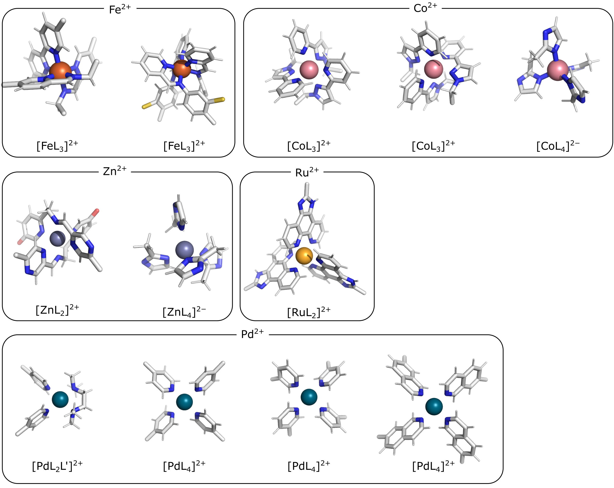
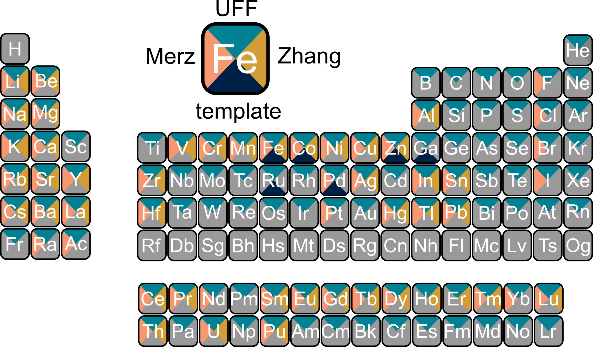

Usage
=====

.. _usage:

Python module
------------

Quick_start

Parametrization of structure with coordinates saved as `supramolecular_cage.xyz` with (nonbonded) topology `supramolecular_cage.top` (of the whole structure):

.. code-block:: python

    from metallicious import supramolecular_structure
    cage = supramolecular_structure('supramolecular_cage.xyz',
                                    metal_charges={'metal name 1': charge of metal 1(integer), 'metal name 2':charge of metal 2(integer),...},
                                    topol='supramolecular_cage.top', vdw_type='uff')
    cage.parametrize(out_coord='out.pdb', out_topol='out.top')

For example, for the structure ru_pd.xyz with force-field parameters saved as ru_pd.top, which consists of two metals Pd2+ and Ru2+, the input file looks like this:

.. code-block:: python

    from metallicious import supramolecular_structure
    cage = supramolecular_structure('ru_pd.xyz', metal_charges={'Ru': 2, 'Pd':2 }, topol='ru_pd.top', vdw_type='uff')
    cage.parametrize(out_coord='out.pdb', out_topol='out.top')

## Initial topology file
If you don't have a topology file, you can generate a simple force-field parametrization using General Amber Force-field (GAFF):

.. code-block:: python

    from metallicious import supramolecular_structure
    cage = supramolecular_structure('ru_pd.xyz', metal_charges={'Ru': 2, 'Pd':2 }, vdw_type='uff')
    cage.prepare_initial_topology()
    cage.parametrize(out_coord='out.pdb', out_topol='out.top')

However, we do not intend to automate the parametrization of the organic part of the molecule.
Please refer to specialized tools such as gromacs, atb, ambertools, and charmm-gui.

# Handling missing templates

The number of combination of possible ligands and metal results that inevitibly you will encounter metal site for which there is no template.
In such cases to solutions are possible:

### 1. Parametrize template
We recommend to run template parametrization on HPC/cluster as it can take some time (our experience is ~8h on 8 CPUs per template).

Specifying explicitly the metal multiplicity using the metal_charge_mult variable instead of metal_charges, will automatically inform metallicious to be ready to parametrize the template

.. code-block:: python

    from metallicious import supramolecular_structure
    cage = supramolecular_structure('ru_pd.xyz', metal_charge_mult = {'Ru': (2,1), 'Pd':(2,1)}, vdw_type='uff')
    cage.parametrize(out_coord='out.pdb', out_topol='out.top')

### 2. Truncate existing template

If an exact template is unavailable in the library, you can truncate part of an existing template.
Truncation is based on the distance from the metal centre, such as 4-bonds away ("dihedral"), 3-bonds away ("angles"), or 1-bond away ("bonds").
Such a strategy is fast but results in a loss of accuracy.

For example:

.. code-block:: python

    from metallicious import supramolecular_structure
    cage = supramolecular_structure('ru_pd.xyz', metal_charge_mult = {'Ru': (2,1), 'Pd':(2,1)}, truncation_scheme = 'dihedral')
    cage.parametrize(out_coord='out.pdb', out_topol='out.top')

The extended list of supramolecular_structure class:

    :param filename: (str) name of the coordination file
    :param metal_charge_mult:  (dict) the names charges, and multiplicity of the metals in format
                                    {metal_name: (metal_charges, multiplicity)}
    :param metal_charges: (dict) the names and charges of metals in the input structure in format:
                                      {metal_name1: metal_charges1, metal1_name2: metal_charge2}
    :param vdw_type: (str) name of LJ dataset used for metal paramters
    :param topol: (str) path to topology (optional)
    :param keywords: list(str) the keywords for QM calculations
    :param improper_metal: (bool) if True it will parametrize the improper dihedral involving metal
    :param donors: (list(str)) list of atom elements with which metal forms bond
    :param library_path: (str) directory of template library, be default where the script is
    :param ff: (str) parametrization protocol for small organic molecules (only gaff available)
    :param search_library: (bool) if True, metallicious searrched templates in template library,
                if False, it will parametrize template
    :param fingerprint_guess_list: (list(str)) list of templates to check
    :param truncation_scheme: (str) name of the truncation scheme
    :param covalent_cutoff: (float) if metal-atoms smaller then cutoff it creates bonds ligand with metal

Bash command line
------------

It is also possible to use the metallicious just form command line. For example:

metallicious -f cage.xyz -vdw_type merz-tip3p -metal_and_charges Pd 2 -prepare_topol

For details, see:

metallicious -h

Possible input for bash command:

.. list-table:: Title
   :widths: 25 25 50
   :header-rows: 1

   * - Variable
     - Comment
     - Possible input
     - Default
     - Required
   * - -h, --help
     - Show help message and exit
     - Possible input
     - None
     - No
   * - -f
     - Metaloorganic coordination file
     - *.gro, *.pdb and other coordination formats supported by MDAnalysis
     - None
     - Yes
   * - -p
     - Metaloorganic force-field parameters of non-bonded model
     - .top, .prmtop, etc. and other supported by ParmEd
     - None
     - Yes (unless prepare_topol specified)
   * - -of
     - Output metaloorganic structure
     - .gro, .pdb and other formats supported by MDAnalysis
     - out.pdb
     - No
   * - -op
     - Output metaloorganic topology
     - .top, .prmtop and other formats supported by ParmEd
     - out.top
     - No
   * - -metal_and_charges
     - Metal names and charges (optionally, multiplicity when parametrization needed)
     - Names and charges are separate by whitespace (e.g., Pd 2 Ru 2) or names, charges and multiplicities separated by spaces (e.g., Pd 2 1 Ru 2 1)
     - None
     - Yes
   * - -keywords
     - autodE keywords for QM calculations
     - See autodE or ORCA manual
     - PBE0 D3BJ def2-SVP tightOPT freq
     - No
   * - -LJ_type
     - Type of parameters for Lennard-Jones parameters
     - uff, merz-tip3p, merz-opc3, merz-spc/e, merz-tip3p-fb, merz-opc, merz-tip4p-fb, merz-tip4-ew, zhang-tip3p, zhang-opc3, zhang-spc/e, zhang-spc/eb, zhang-tip3p-fb, zhang-opc, zhang-tip4p/2005, zhang-tip4p-d, zhang-tip4p-fb, zhang-tip4p-ew
     - merz-opc
     - No
   * - -truncate
     - Truncation scheme
     - None, 3bond/dihedral, 2bond/angle, 1bond/bond
     - None
     - No
   * - -improper_metal
     - Calculate the improper dihedral of the metal-aromatic
     - True/False
     - False
     - No
   * - -donors
     - Donors from the connected ligands, usually electronegative atoms, such as N, S, O, but sometimes metal is connected to carbon
     - Any element name separated by space
     - N S O
     - No
   * - -prepare_topol
     - Prepare initial topology using GAFF
     - True/False
     - False
     - No
   * - -linker_topol
     - Linker force-field (topology) parameters, only used when prepare_topol=True
     - .top, .prmtop, etc. and other supported by ParmEd
     - None
     - No

Available parameters
------------

Default templates

Lennard-Jones

